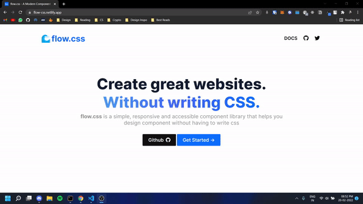

# flow.css
[](https://app.netlify.com/sites/flow-css/deploys)

A modern component library to help you ship faster

Checkout the site [here](https://flow-css.netlify.app/)

# Usage

To use the library, add the following to your `<head>`:

```html
<link rel="stylesheet" href="https://flow-css.netlify.app/components.css" />
```

## Starter Template

Be sure to have your pages set up with the latest design and development standards. That means using an HTML5 doctype and including a viewport meta tag for proper responsive behaviors. Put it all together and your pages should look like this:

```html
<!DOCTYPE html>
<html lang="en">
  <head>
    <meta charset="UTF-8" />
    <!-- Required meta tags -->
    <meta http-equiv="X-UA-Compatible" content="IE=edge" />
    <meta name="viewport" content="width=device-width, initial-scale=1.0" />
    <!-- flow.css -->
    <link rel="stylesheet" href="https://flow-css.netlify.app/components.css" />
    <!-- FontAwsome CDN -->
    <link
      rel="stylesheet"
      href="https://cdnjs.cloudflare.com/ajax/libs/font-awesome/6.0.0/css/all.min.css"
    />
    <title>flow.css</title>
  </head>
  <body>
    <h1 class="color-primary">Hello World</h1>
  </body>
</html>
```

# Components

- [Alert](https://flow-css.netlify.app/components/Alert/alert.html)
- [Avatar](https://flow-css.netlify.app/components/Avatar/avatar.html)
- [Badge](https://flow-css.netlify.app/components/Badge/badge.html)
- [Button](https://flow-css.netlify.app/components/Button/button.html)
- [Card](https://flow-css.netlify.app/components/Card/card.html)
- [Image](https://flow-css.netlify.app/components/Image/image.html)
- [Input](https://flow-css.netlify.app/components/Input/input.html)
- [List](https://flow-css.netlify.app/components/List/list.html)
- [Modal](https://flow-css.netlify.app/components/Modal/modal.html)
- [Naviagtion](https://flow-css.netlify.app/components/Navigation/navigation.html)
- [Rating](https://flow-css.netlify.app/components/Rating/rating.html)
- [SimplifiedGrid](https://flow-css.netlify.app/components/SimplifiedGrid/simplified-grid.html)
- [Slider](https://flow-css.netlify.app/components/Slider/slider.html)
- [Toast](https://flow-css.netlify.app/components/Toast/toast.html)


# Preview



# Contributing

Pull requests for new features, bug fixes, and suggestions are welcome! Please create an issue for discussion before working on a substantial change.

To contribute to this library:

1. **Fork** the repo on GitHub
2. **Clone** the repo on GitHub
```bash
git clone https://github.com/thegeorgenikhil/flow.css.git
```
3. **Create** a new branch
4. **Commit** your changes to your own branch
5. **Push** your branch to GitHub
6. Submit a **Pull Request** so that we can review your changes

